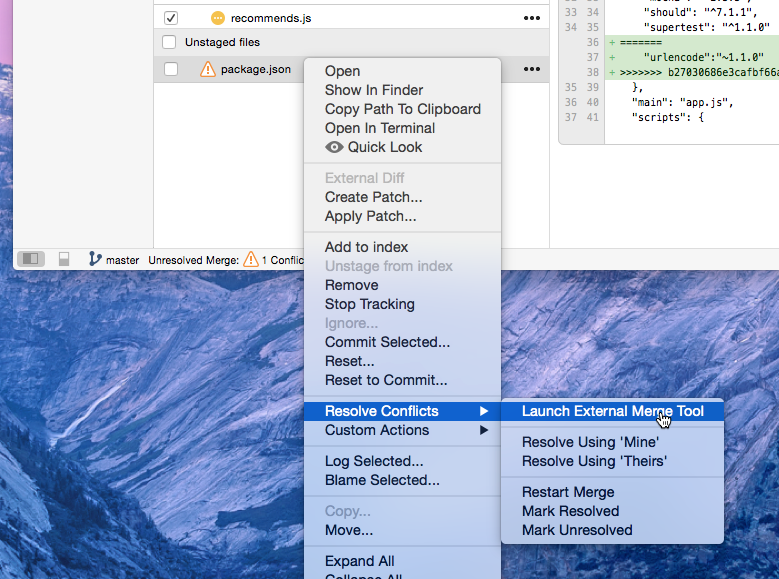
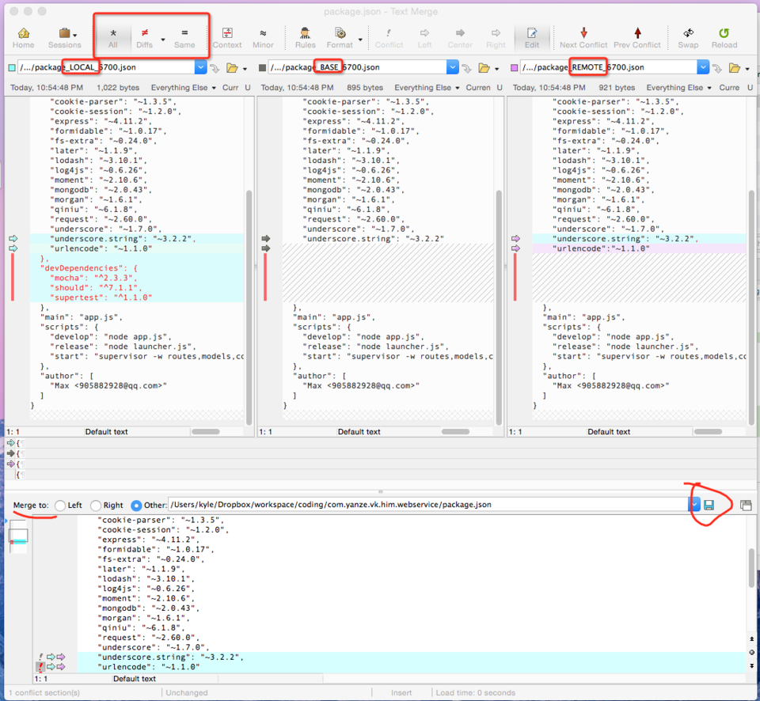
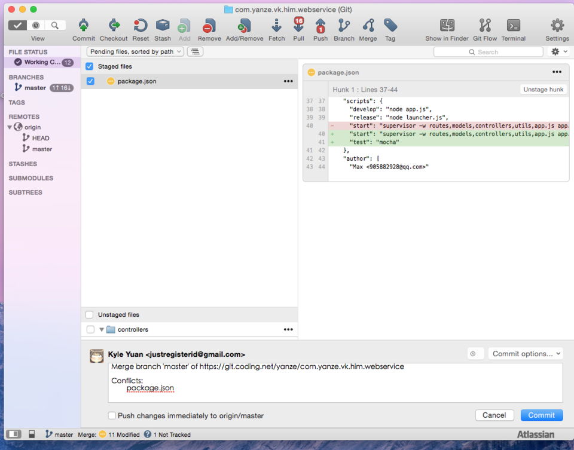
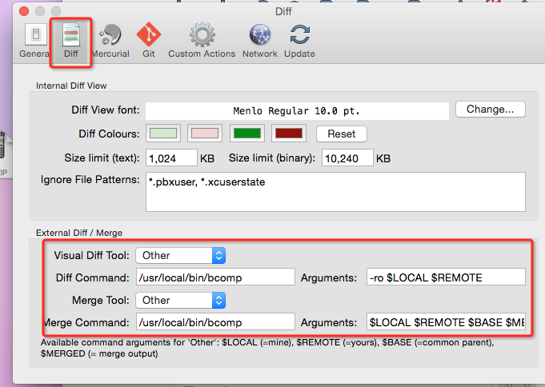

使用场景:

如图提交代码发生冲突时,`右键-解决冲突-启用外部合并工具` 启动`Beyond Compare`,

如图,打开了冲突代码,分成左中右三栏,左边是本地,右边是远程,中间是上一次的,工具栏可以设置仅显示不同代码或全部代码,底栏是最后合并后的代码,点击三栏中要保留的代码段就放到底栏,修改后点保存按钮,然后从菜单栏退出.

回到sourcetree,在工作副本栏有刚解决冲突的文件,点击提交并推送.这样就解决了冲突.
(同时还有一个未暂存以.orig后缀的文件,记录了解决方式,可以忽略或移除.)

#### 使用前的设置
安装SourceTree和BeyondCompare,打开BeyondCompare菜单栏,Install Command Line Tools.
打开SourceTree的设置-Diff项,如图设置,输入路径和变量.

>From the Beyond Compare menu, Install Command Line Tools.  Then:

    Visual Diff Tool: Other
    Diff Command:/usr/local/bin/bcomp
    Parameters:-ro $LOCAL $REMOTE
    Merge Tool: Other
    Merge Command:/usr/local/bin/bcomp
    Parameters:`$LOCAL $REMOTE $BASE $MERGED`

链接内有其他版本控制软件的设置方法:
<http://www.scootersoftware.com/support.php?zz=kb_vcs_osx#sourcetree>

