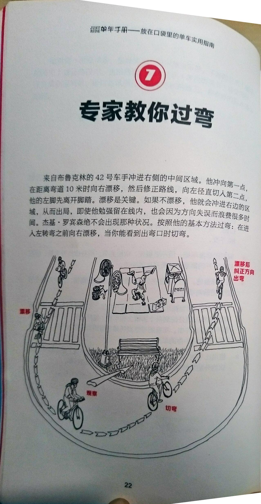
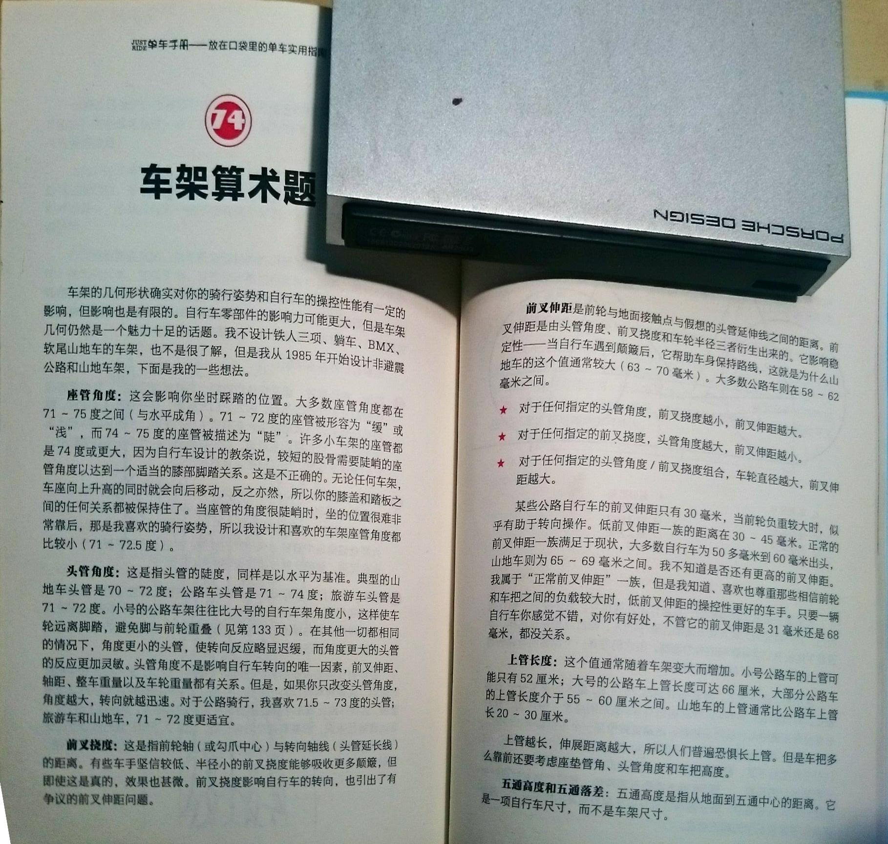
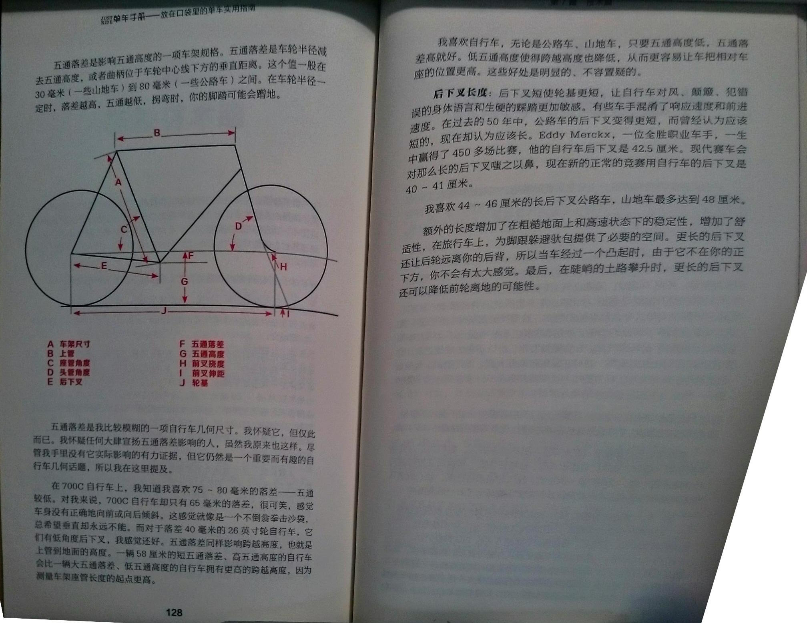

这本书让我这个刚买了1000+配件、学人家往专业跨进、经历了0速摔车以及脸刹的人,重新思考了一下,如果我一辈子都不打算成为专业,这些一切是否还有必要？
最后我的结论是:呐!做人呢,最重要就是开心！感情的事不能强求的,饿不饿,我煮碗面给你吃？

以下笔记试图简单总结文章思路,然而有些篇章并没有中心思路这类玩意,甚至有些问题作者只是把他抛出来而已,可能侵权,详细内容请见原书.

### 骑行篇
1. 踩踏学问:圆周踩踏只是理论,实际都是在向下踩,最有效的踩踏方式只是将处于上升阶段的脚踏上面的重量降到最低.
2. 骑车中的算数:结合自身实际,选择能够鼓励自己的数据.
3. 自行车的档:略.
4. 胖人如何爬坡:利用体重,站起来,略左右倾.
5. 骑车技术才是根本:躲避颠簸路面.
6. 如何降低冲击:
前轮经过凹凸时,身后倾斜;放松关节;看得远,绕过颠簸;长颠簸路面,身体稍离开车座,双腿夹住;使用略宽、软的外胎.
7. 专家教你过弯:
    - 过弯前往相反方向漂移,看到出湾口时切弯,(类似于开车掉头时可以先打相反方向,给自己留下更多过弯空间),有用的技术:倾斜车身,保持身体直立;相反;内侧膝盖伸出/收回.
    - 分别尝试选择其中一种,然后:1.保持内侧脚踏在最上方;给外侧施加压力.2.眼睛看要去的地方.3.在车座上转动你的髋关节,指向弯道.

8. 用腿换档:运用肌肉,不要过分依赖档位.
9. 贵在坚持:短距离也没什么不好.
10. 教孩子骑车:选择一辆可以滑行(双脚着地)的自行车,而不是带辅助轮的(因为骑行靠的是平衡).

### 服装篇
11. 穿衣的策略:一切皆可,注意常站起来;使用裤夹.
12. 长短袖:夏季宽松的长袖衬衫也不错.
13. 环保的颜色:穿得专业就会把树林看作赛道,骑得慢的同伴视为障碍.(林道骑行不要吓到小动物踩到花花草草,请与森林融为一体.)
14. 服装材料的秘密:防水与透气,外部湿度小于衣服内部的情况下才有作用,也就是说雨天无效.
15. 骑车与内裤:1~2小时的短途骑行,穿着内裤也无妨.
16. 穿鞋的策略:自锁系统:鞋底的硬度和360度发力都是谎言.不上锁的优势:略.(就我来说上锁的好处是高频擦踏时会比较安心.)
17. 最可靠的雨披.(下雨就别骑了嘛)

### 安全篇
被动安全(头盔、手套、护具)和主动安全(技术).

18. 让别人知道你的目的:就是让你的行为具有可预测性.让司机更小心的方法就是表现出不可预测性(比如你国电动车),举例的安全摆动,即在车距离你3~4秒时快速摆动,让别人看着很不稳定.(简直作死)
19. 危险-闪烁的车灯.可能会让酒驾或疲劳驾驶的司机认为你是一辆机动车,然后就跟上来了.解决方案:常亮.(此处不解,刚买了一个会煽的)
20. 危险-打开的车门.绕过的同时注意后方,不讲求屄格可以装后视镜.
21. 享受自行车道.(附近的自行车道通常是和人行道一起的,有时候和公交车一起,左转的路口则是和机动车一起)
22. 自行车道礼仪:慢,远离他人,铃声、嗨表示接近,超车时距其他自行车60cm,不高于规定限速,靠右行驶,左侧超车,不要像发情的公狗一样搭讪骑车的女生,夜间开灯.从根本上说,自行车道的安全就是要保护别人,如果你撞了人,那就是你的责任,因为你不够小心.
23. 头盔不是万能的:增加风险补偿,简单说就是你戴了头盔觉得可以大胆骑行,这样可能反而更危险了.正确的方式就是你戴了但是要假装你没戴.
24. 该不该戴头盔:同上条的风险补偿.个人觉得30+km/h、晚上都应该戴.
25. 如何正确的佩戴头盔:保持水平.圆型最好.
26. Moe Howard头盔.
27. 让别人看见你:大个反光版完胜小灯.多贴反光胶带.
28. 夜间照明:照明灯、警示灯,头灯更方便.
29. 遇到凶狗怎么办:盯住眼睛:“bad dog”、放狗喷雾、无法逃走时用车、打气筒做盾牌、爬到高出.(个人的经验是怒视,低头作势拿东西打他的意思,还可以学狗叫,跟他对喷,技巧就是用力急速短促的喷出F字母,这招上周刚用过,当时那个狗就懵逼了,道理我都懂 但为什么要对单身狗这么残酷)
30. 块拆的正确使用:简单说就是把手不动,另一侧稍微拧紧,最后把手拧至CLOSE一侧.

### 健康篇
31. 骑车是一项全能运动:骑车是一项基础运动,主要使用腿部和臀部肌群,但4~6周后回报比变得很低,也不够全面,长时间、艰苦骑行会释放皮质醇,抑制钙质吸收,变泡沫状骨骼,建议一部分时间骑车,剩下的做其他你想做的一切事情.
32. 骑车饮食:
  - 运动会增加食欲;
  - 节食不可取;
  - 减肥需要用低碳水化合物食品(瘦肉、蛋、奶酪、地上蔬菜、浆果、巧克力)替代高碳水化合物食品(香蕉、燕麦、橙汁、面食、啤酒、过甜的水果、风干的水果、全谷物也会升高血糖和胰岛素水平);
  - 4小时普通骑行/1小时激烈骑行只喝水就可以了;
  - 摄入碳水化合物会转变成葡萄糖,过多的糖是有毒的,需要胰岛素,胰岛素过多就无妨燃烧脂肪,甚至把热量转换为脂肪储存;
  - 每周一两次,空腹锻炼到疲劳(5~15分钟),然后继续空腹1小时,这样会让生长激素维持高水平,帮助增肌减脂.(FIT、食物百科APP)
33. 碳水化合物会使你发胖:你不是运动员不需要能量棒之类的,必须补充时请在骑行中补充.
34. 综合锻炼,全面加强:壶铃;交叉健身、瑜伽和普拉提、Tabata、Burpees.
35. 拉伸运动:拉伸无法改变你的体型,下面三个动作可以保持你的身体拉伸到可以骑车的状态:下蹲、悬挂、下犬式.
36. 心率检测指南:检测方法 10秒钟的脉搏数X6.(个人推荐迪卡侬GEONAUTE110,可以设定心率区间警告,灯光).
37. 了解你的心脏:血糖、甘油三酯、胆固醇、最大心率(MHR):
	- 女206-(年龄X0.88);
	- 男206-(年龄X0.7);
	- MHRX0.5~0.7:燃烧脂肪;
	- MHRX0.7~0.88:消耗碳水化合物,训练时成绩更好;
	- MHRX0.9~0.10:无氧范围,增肌.
38. 什么时候喝水:渴了再喝.
39. 电解质的秘密:酸碱盐,帮助调节体内盐和水以及血液的PH值,高碳水化合物运动饮料会让人发胖,替代品:水和橙汁1:1混合加入盐;番茄汁;椰奶.
40. 车座与阳痿:不长时间骑车问题不大,常离开你的车座.
41. 什么样的车座好:屁股坐的地方至少要16.5cm,海绵或胶质太软会挤压到档部神经,中间应足够窄不影响骑行.时长一般不超过5小时凹槽也非必须.
42. 如何选购车座:自己多试用.
43. 女式专用车座.
44. 趣味车座.
45. 保养牛皮车座:不要弄湿;避免太阳直射;润滑;该换就换.

### 配件篇
46. 车铃.
47. 车包.
48. 车筐.
49. 挡泥板.(迪卡侬有快拆式的)
50. 车支架.无论任何时候你看到一辆没有车支的自行车,你看到的都是收到竞赛影响但是对不比赛的人毫无意义的又一实例.五通后面:中腿单装/双装;后装单腿.
51. 打气筒:二氧化碳充气瓶比手动大气快2分钟.车架气筒,秘密气筒.(家里备一个全尺寸,骑行带一个迷你好了)
52. 狗嘴脚踏:作者认为比自锁好,但更好的方式是穿你平时的鞋. 
53. 手套:作者认为无用.

### 保养篇
本篇告诉你一些属于保养维修但其他书籍都没涉及的内容.

54. 用树当车价.
55. 神奇的链条.
56. 何时更换链条:挂在大尺盘上,抓住上半圈一节链条,向前拉起.如果本来被链条遮挡的呀盘齿露出来,即表明已被拉长,需要更换.
57. 如何保养链条:清洁方法:温水、清洁剂、硬毛刷. 将链条变到中飞,前后转动脚踏,刷洗上半圈,然后下一段.(有洗链器) 润滑:发出声音时需要润滑.作者喜欢蜡性链条油.
58. 掉链:抓住齿盘后下面掉落的链条,向前拉,从五通那儿套在掉落的齿盘上,向后转动曲柄.
59. 卡链:预防:变速时减小脚踏上的压力,保持链条清洁、润滑,在齿盘磨损出勾形前更换齿盘.处理:停止踩踏、下车后向后倒曲柄1/4或半圈,脚踩下半圈链条.
60. 保养:作者几乎不管,每年会擦腕组或后下叉的油渍.方法:软刷、Dawn清洁剂,刷子沾水轻刷个大概,远离轴承,用水管冲洗泡沫,然后用抹布/压缩空气吹干链条,擦拭链条上油水.打蜡.
61. 包扎伤口.碳纤维表面的刻痕划痕通常预示着危险,请直接换新.金属车架划痕或油漆剥落,可能会慢慢扩大,如果只是油漆受损,尽快补漆,应急方法:指甲油、模型漆、油脂、护唇膏.
62. 使用只美.(类似于养牛吧)
63. 虫胶把带. 
64. 麻绳的妙用.(代替胶带)

### 技术篇
65. 寻找适合你骑的自行车:作者认为车把比座高5~10厘米才是正常.(额,道理我都懂,只是没勇气这样做)
66. 如何握把:作者推荐高把立,有更大的调整空间,推荐Nitto鹅把立.
67. 骑车时正确坐姿.踩踏最低点时,脚保持水平,膝盖微弯.两种方法:
	- 耻骨高度(PBH)法,脚至挡部旁边,重复3次,取最高值,车座高度——从车座顶部到曲柄中心的距离,平行于坐管——等于PBH减去11cm;
	- 试错法,车座升高,脚尖够着脚踏.每次降低6mm,直至脚在最低点能够放平.
68. 车座的前后位置:比赛车手的方式是,挡曲柄水平时,膝盖下缘的凸块位于脚趾球和脚踏轴的正上方,可以使用铅锤测量.车座靠后可以防止身体太靠前,避免手臂承受太多重量,方便爬坡时更快运用力量.标准不唯一.
69. 重量的秘密:车重加上体重轻车的优势将大大缩小.康奈尔的实验人员得出结论,没增加/减少5.4千克,速度每小时相差1.6千米,通勤时红灯可以瞬间消除速度差距,重的下坡更快,加速慢但是维持速度有优势,允许更宽轮胎不容易扎胎,编队骑行时容易跟上队伍.
70. 曲柄多长合适,曲柄长度指从曲柄安装孔中心到脚踏安装中心的距离,腿短的人用165~170,普通170~175,长腿175或更长,微斜车身时最低位脚踏不应撞地面.
71. 什么是Q值:描述左右曲柄脚踏安装孔外侧之间的距离.长腿受Q值影响小,双脚内旋宽Q值更好,专业公路车Q值140~150mm,公路车140~155,山地160~190.
72. 车架与轮胎的关系:公路车应该有足够容纳32mm的轮胎和挡泥板,公路旅行车应该能使用40mm的轮胎加挡泥板,山地或越野公路应该能使用50mm的轮胎和挡泥板.挡泥板需要轮胎的顶部与车架或刹车之间有大约7mm间隙,17mm是一个比较合适的挡泥板间隙.
73. 轮胎的分类.
	- 侧壁:肤壁,颜色、重量最轻,脆弱,不适合日常;
	- 胶壁,最重,少见;黑壁,实用.
	推荐添加了橡胶、尼龙、凯夫拉的防穿刺轮胎(更重).
74. 车架算数题目.

75. 什么材质的车架好.
	- 钢:最结实、安全(问题会慢慢发作)、可修复、耐用;
	- 铝:钢的1/3重,变形后很快疲劳,便宜;
	- 钛:钢的1/2重,硬度也是钢一半比铝硬,不易修复,价高;
	- 碳纤维:高强度,弱点是缺陷容忍值低,突然断裂等问题;
	- 竹与木;
76. 什么是TOC:脚轮重叠,急转弯时,前轮撞到鞋或脚踏.矮小的人容易碰到这个问题,但过弯靠倾斜车身,所以不用在意这个问题.
77. 700C中的C代表什么:700规格的车中,C类是小车圈加大轮胎.
78. 关于前叉:作者喜欢钢叉:缺陷宽容度最高,问题往往从表面开始容易探测缺陷,与碳相比不会突然断裂.

### 哲理篇
79. 比赛效应:对于有钱的普通骑车人来说,公路自行车就应该像职业车手比赛用车一样,然而,对于一次非比赛的骑行活动,它却是一辆偏离了初衷的自行车.
80. 获得赞助.
81. 慈善骑行活动的另一面.
82. "Commute Clot"与"Critical Mass".
83. 家庭骑行:
	- 做教练员;
	- 坚持正确的鞍座高度;
	- 强调跟车的神奇作用;
	- 给所有人买高级自行车;
	- 告诉他们昂贵的自行车会让爬坡更轻松,让他们努力提高;
	- 让他们穿紧身花哨的骑行服;
	- 上自锁(强调容易,鼓励用语“360度发力”);
	- 榜样的力量,骑车作用;
	- 送给你十几岁的女儿一条用自行车链条制成的手镯或项链,用蒂夫尼的袋子,让她感觉“两者同样美丽”;
	- 跟孩子们比赛.有效的方法:让儿子自己选择衣服,然后尼穿得像他那样,这样尼不会特别显眼,在公共场合让他难堪;
	- 如果车座太低又不愿升高,耐心等待;
	- 让别人设定节奏;
	- 骑低档次的自行车,融为一体;
	- 边骑边聊,做个普通人;
	- 骑到目的地(目标,奖励).
	- 不要试图说服不感兴趣的伙伴加入你的骑行活动.
84. 如何带着孩子骑车:拖车、亲子自行车、双人自行车.
85. S240:24小时内自行车露营过夜活动.物品清单:睡袋、睡垫、枕头、帐篷(防雨风虫)、头灯、书籍、牙具、额外的衣服、刀、食品、刀叉碗盘、毛巾纸巾
86. 自行车的两个极端:你或许已经丧失了自己的观点:
	- 认为一辆14千克的自行车很重;
	- 认为梁变和把端变速不方便;
	- 认为28mm轮胎太宽;
	- 认为36根辐条太多;
	- 认为22毫米车圈很宽;
	- 认为8/9速飞轮不够用;
	- 认为弯把和车座高度相同是可笑的.
	- 好的自行车能够做很多事.(你不是专业,就不必被专业的条条框架所限制)
87. 你永远都是第一:自己设定目标,乐观看待数据.
88. 尽情享受骑行的乐趣.不管你的自行车多少钱,除非用来谋生,否则它就是一个玩具,应该乐趣无穷.不要参加你必须训练才能完成的骑行;按照自己的节奏骑车;如果骑行一开始就希望可以快速到达终点,那么干脆转身回家,更好的做法是到达起点之前对骑行进行评估,如果痛苦超过了乐趣,就不要参加;每次骑行都使用这个过滤器:如果我没法讲述这次经历,我还去吗？不能穿T恤或运动皮带扣呢？如果不行就别开始(运动皮带扣什么鬼？);克制自己,会让你更渴望骑行;不要因为内疚自己嘴馋或体胖而去骑车;永远不要因骑行不够长不够努力而内疚.
89. 小测验:
    * 我最喜欢的自行车可以携带1KG西兰花和大厚毛衣;
    * 挡一个胖老头骑车一辆便宜的自行车超过我时,我不追他;
    * 我有一个自行车带挡板,使用至少35mm轮胎;
    * 我需要1分钟或者更少的时间穿着骑车的衣服,包括鞋子;
    * 我更期待开始骑行,而不是结束;
    * 我是我的自行车老板,不骑它不是为了避免因为没骑而感到内疚;
    * 我宁愿一辆可靠的,有着30年历史的、价值700美元的五项全能自行车,也不愿意骑一辆最新式的、价值12000美元的专项自行车;
    * 我就是喜欢经常骑我的自行车,即使没有人看见我,没人谈论、发推特或吹嘘它;
    * 我可以在公众面前穿着我骑车的衣服,我的家人也不会感到尴尬,也不会招来孩子们的围观;
    * 我只能说出几个职业自行车手和车队. 
    
如果6项以上的回答是“是”,那么你是一个非比赛型的车手,你的前方正有一条美好、光明的大道等着你去骑行.

### 链接
- [单车手册](https://book.douban.com/subject/25918674/)
- 同时推荐另外一本书 [BIKE FIT ：骑行姿势设定指南](https://book.douban.com/subject/26757374/)

