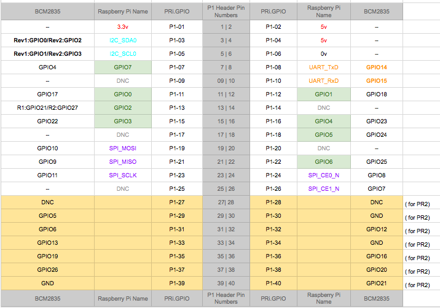

###RPi.GPIO模块

GPIO:General Purpose Input Output 即 通用输入/输出

RPi.GPIO是一个用来控制树莓派GPIO的python模块

```
import RPi.GPIO as GPIO`

GPIO.setmode(GPIO.BOARD)
#or GPIO.setmode(GPIO.BCM)
```

两种模式，BOARD就是板子上这种1-40实际引脚，BCM则是根据BCM2835的寄存器编号。

详见下图：  


可以用getmode()函数detect一下,查看当前模式。


####设置一个channnel
```
GPIO.setup(channel, GPIO.OUT, initial=GPIO.HIGH)
#通常是OUT对应IN,HIGH对应LOW反例不再列出.
```
####多个channel
```
c_lsit = [1, 2]
GPIO.setup(c_list,GPIO.OUT)
```

####数个channel
```
c_list = [11,12]    # tuples也可
GPIO.output(c_list, GPIO.LOW)     #全LOW
GPIO.output(c_list, (GPIO.HIGH, GPIO.LOW))    # 1HIGH ,2LOW 
```

####Output
```
设置GPIO针脚的输出状态

GPIO.output(channel, state)
#状态0/GPIO.LOW/False 或者相反.
```

####Input
```
读取GPIO针脚值

GPIO.input(channel)
#返回上例output中的状态值.
```


####Cleanup
```
GPIO.cleanup(channel)     #list,tuples皆可
```